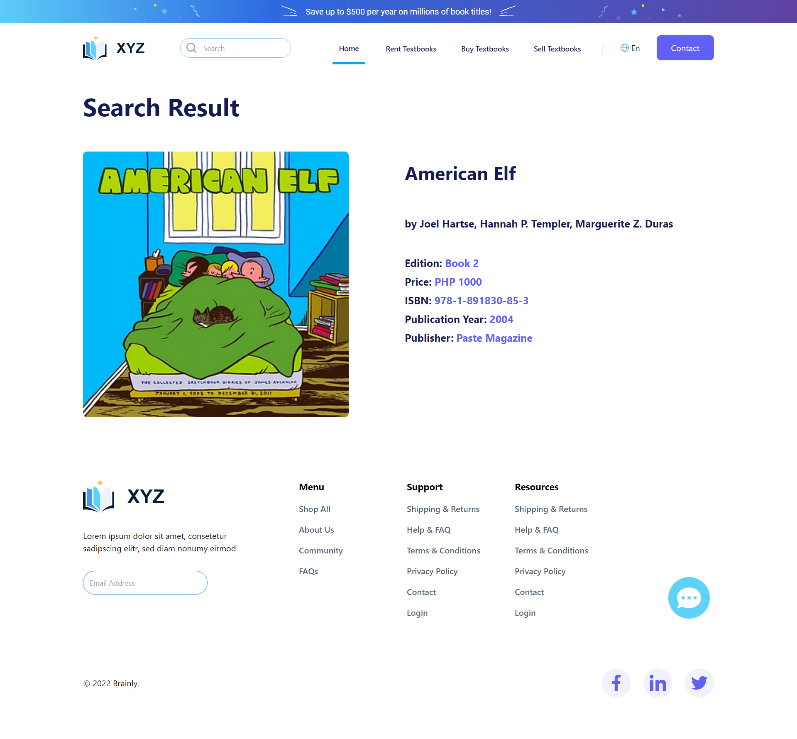
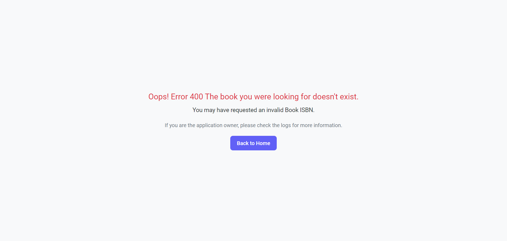
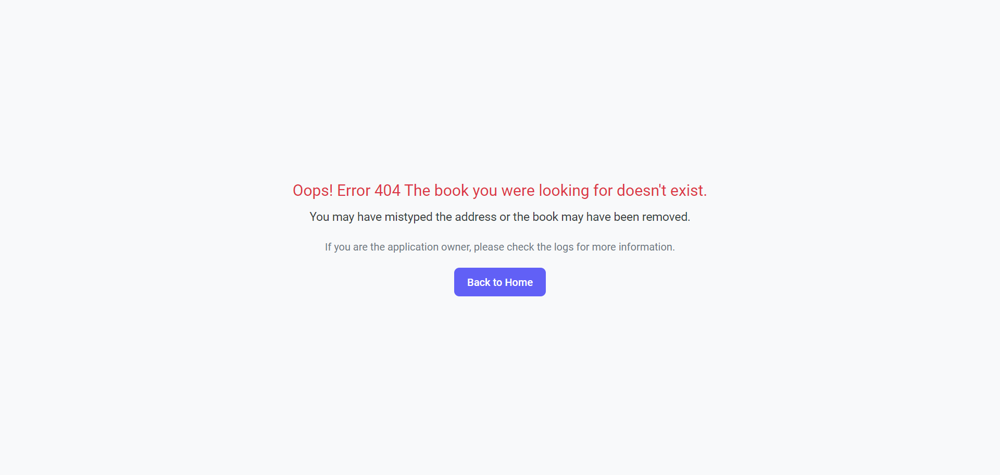

# XYZ Books

XYZ Books is a versatile application designed to streamline information retrieval from students, college textbooks, and course materials. With features such as displaying product data like authors and publishers, and seamless ISBN conversion between different formats, XYZ Books simplifies the process of accessing and managing academic resources.

Get started by cloning the repository, configuring as needed, and exploring the intuitive interface. For detailed guidance, refer to the included documentation. We welcome contributions and value your feedback to continually enhance XYZ Books. Join us in this journey of knowledge discovery.

## Code Documentation

- [API Documentation](https://documenter.getpostman.com/view/15112734/2sA35MyJi7)  
- [Controller Actions](documentations/code-documentation.md)  
- [Seed Services](documentations/seeds-documentation.md)
- [Testing](documentations/testing.md)
- [Database Design-Diagram](https://dbdiagram.io/d/XYZBooks-65f8e4b3ae072629ce579976)

## Tools

- ruby 3.1.3
- rails 7.0.4
- tailwind 2.3
- isbn-converter 0.1.0
- isbn-tools 0.1.0
- postman
- factory_bot_rails

## After clone-do:

run

`cd XYZ_Books`  
`bundle install`  
`./bin/rails tailwindcss:install`  
`rails db:create`  
`rails db:migrate`  
`rails db:seed`  

## To start the app:

run
`bin/dev`

## To run rspec test:

run
`rspec`

---

## XYZ Books Full Webpage

### XYZ Books Result Page

### XYZ Books Error Page 400 and 404

---

(c) mumble-dev
